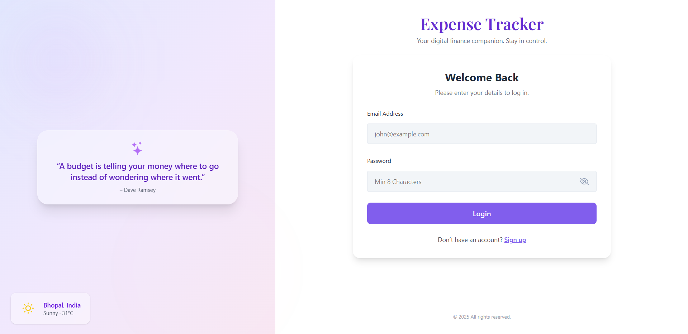
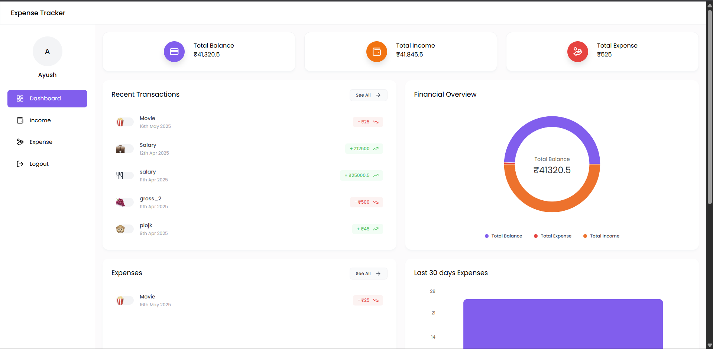
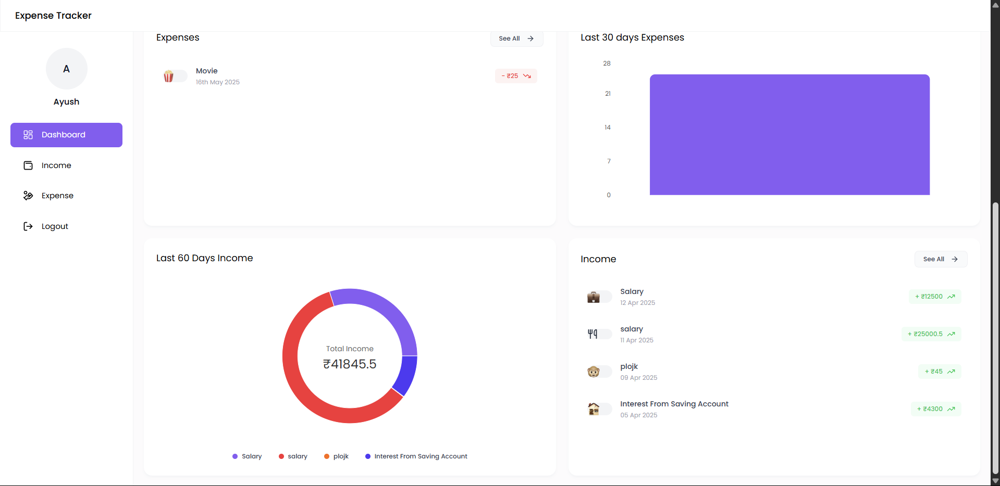

# 💰 Expense Tracker

Your digital finance companion. Stay in control of your daily expenses and income.

This application provides a sleek and intuitive interface to log your transactions, visualize your financial overview, and track your spending habits.

## ✨ Features

* **User Authentication:** Secure login for individual users.
* **Dashboard Overview:** At-a-glance view of Total Balance, Total Income, and Total Expense.
* **Financial Visualizations:** Intuitive pie charts to understand your income and expense distribution.
* **Recent Transactions:** Quickly see your latest income and expense entries.
* **Detailed Transaction Lists:** Separate sections for all income and expense transactions.
* **Monthly Budget Tracking:** Tally expenses against income on a monthly basis.
* **Interactive Charts:** Bar chart for tracking last 30 days' expenses.

## 📸 Screenshots

### Login-SignUp Page
A clean and welcoming login interface to access your personal finance dashboard.


### Dashboard - Overview
Your main financial overview, showing key metrics, recent transactions, and a balance distribution chart.


### Dashboard - Expenses & Income
Detailed views of your expenses over the last 30 days and a breakdown of your income sources.


## 💻 Tech Stack

*(**Note:** This is an assumed tech stack based on common web development practices and your previous context. Please modify this section if your actual tech stack is different.)*

**Frontend:**
* **React.js:** A JavaScript library for building user interfaces.
* **Vite:** A fast build tool for modern web projects.
* **HTML/CSS:** For structuring and styling the application.
* **Charting Library (e.g., Recharts, Chart.js):** For financial visualizations.

**Backend (Assumed):**
* **Node.js / Express.js:** For building the RESTful API.
* **Database (e.g., MongoDB, PostgreSQL, SQLite):** For storing user data and transactions.
* **Authentication (e.g., JWT, Passport.js):** For secure user login.

## 🚀 Getting Started

Follow these steps to set up and run the Expense Tracker project on your local machine.

### Prerequisites

Before you begin, ensure you have the following installed:

* **Node.js:** (LTS version recommended) - [Download Node.js](https://nodejs.org/en/download/)
* **npm** (Node Package Manager) or **Yarn** (comes with Node.js installation)
* **Git:** [Download Git](https://git-scm.com/downloads)

### Installation Steps

1.  **Clone the repository:**
    Open your terminal or command prompt and run:
    ```bash
    git clone [https://github.com/ayushpandey101/Expense-Tracker.git](https://github.com/ayushpandey101/Expense-Tracker.git)
    ```

2.  **Navigate to the project directory:**
    ```bash
    cd Expense-Tracker
    ```

3.  **Install Frontend Dependencies:**
    The frontend part of your project is likely within a subfolder (e.g., `frontend/expense-tracker`).
    ```bash
    cd frontend/expense-tracker # Adjust this path if your frontend is named differently
    npm install
    # OR if you use yarn
    # yarn install
    ```

4.  **Install Backend Dependencies (if applicable):**
    *(**Note:** If your backend is in a separate folder like `backend` or `server`, navigate to that folder and install its dependencies. Skip this if your project is purely frontend for now.)*
    ```bash
    # cd ../../backend # Adjust path to your backend folder
    # npm install
    # OR
    # yarn install
    ```

### Running the Application

1.  **Start the Frontend Development Server:**
    From your frontend directory (`Expense-Tracker/frontend/expense-tracker/`):
    ```bash
    npm run dev
    # OR if you use yarn
    # yarn dev
    ```
    This will start the frontend development server, usually accessible at `http://localhost:5173` (or a similar port). The exact URL will be displayed in your terminal.

2.  **Start the Backend Server (if applicable):**
    *(**Note:** If you have a backend, you'll need to start it separately. Replace `server.js` with your actual backend entry file.)*
    From your backend directory (`Expense-Tracker/backend/` or `Expense-Tracker/server/`):
    ```bash
    # node server.js
    # OR if you have a start script in package.json
    # npm start
    # OR
    # yarn start
    ```
    Ensure your backend is running and configured correctly to communicate with the frontend. You might need to set up environment variables for database connections, API keys, etc. (check for a `.env.example` file).

## 🚀 Usage

Once the application is running:

1.  Open your web browser and navigate to the address shown in your terminal (e.g., `http://localhost:5173`).
2.  **Login/Sign Up:** If you're a new user, sign up for an account. Otherwise, log in with your credentials.
3.  **Explore the Dashboard:** View your financial summary.
4.  **Add Transactions:** Navigate to the "Income" or "Expense" sections to add new entries.
5.  **Track Your Finances!**

## 🤝 Contributing

Contributions are always welcome! If you have suggestions for improvements or find a bug, please feel free to:

1.  Fork the repository.
2.  Create a new branch (`git checkout -b feature/your-feature-name` or `fix/bug-fix-name`).
3.  Make your changes.
4.  Commit your changes (`git commit -m 'feat: Add new feature'`).
5.  Push to the branch (`git push origin feature/your-feature-name`).
6.  Open a Pull Request.

Please ensure your code adheres to the project's coding standards.

## 📄 License

This project is licensed under the MIT License - see the [LICENSE](LICENSE) file for details.
